# 📰 Bias Detection in News Articles

**Classifying Guardian news articles on the Israel–Palestine conflict as _Biased_ or _Neutral_ with classic ML and a 1D CNN.**

<p>
  
  
  
  
  
  
  
  
</p>

👥 **Team:** Saed O S Radi, Abdulrahman Zeineddin, Abdelfatah Alhoot — original repository: [ABDULRAHMANszn/Bias_Detection_in_News](https://github.com/ABDULRAHMANszn/Bias_Detection_in_News)

---

## Overview

The project frames media-bias detection as a **binary text classification** task. Articles are collected from [The Guardian Open Platform](https://open-platform.theguardian.com/) and labelled by the section they were published in:

| Label | Source sections |
|---|---|
| **Biased** | `commentisfree` (opinion pieces) |
| **Neutral** | `world`, `middle-east`, `us-news`, `international` (news reporting) |

Only articles mentioning conflict-related keywords (e.g. *gaza*, *west bank*, *ceasefire*, *two-state*) and with at least 60 words are kept, giving a balanced dataset of **5,000 articles (2,500 per class)**.

> ⚠️ Labels come from section metadata, not manual annotation, so they capture *opinion vs. reporting* style and may contain some label noise.

## Features

- **Data collection** from the Guardian Content API with keyword filtering, de-duplication and HTML cleaning
- **Text preprocessing** with spaCy lemmatization and NLTK stop-word removal (keeping modal verbs such as *should*, *must*, *never*, *need*)
- **TF-IDF inspection** script that prints the sparse matrix shape and the top-weighted terms of an article
- **Four classifiers** — Logistic Regression, Perceptron, Linear SVM (grid-searched) and a 1D CNN
- **Evaluation plots** — confusion matrices, ROC curves and learning curves

## Pipeline / How It Works

```
Guardian API ──► data_loader.py ──► guardian_text.csv (5,000 × [text, label])
                                          │
             ┌────────────────────────────┴───────────────────────────┐
             ▼                                                        ▼
   TF-IDF (stop words removed,                          Keras Tokenizer (20k words)
   5k features, uni+bigrams)                            + padding to 400 tokens
             │                                                        │
   ┌─────────┼──────────────┐                                         ▼
   ▼         ▼              ▼                          Embedding(100) → Conv1D(128, k=3)
 Logistic  Perceptron   Linear SVM                     → GlobalMaxPool → Dense(64)
 Regression             (GridSearchCV, 5-fold,         → Dropout(0.5) → Dense(1, sigmoid)
                         C / max_features / n-grams)
             │                                                        │
             └──────────────► accuracy · classification report ◄──────┘
                              confusion matrix · ROC · learning curve
```

1. **Collection** — `data_loader.py` pages through the Guardian API per section until each class has 2,500 articles, then shuffles and saves `guardian_text.csv`.
2. **Preprocessing** — `data_prossing.py` lowercases text, strips URLs/HTML/non-letters, removes stop words and lemmatizes with spaCy (`en_core_web_sm`).
3. **Feature extraction** — the classic models use `TfidfVectorizer` (English stop words, 5,000 features, 1–2-grams); the SVM grid-searches `max_features ∈ {5k, 10k}` and `ngram_range ∈ {(1,1), (1,2)}`. The CNN uses a Keras `Tokenizer` with a trainable embedding layer.
4. **Training** — stratified 75/25 train/test split for the classic models, 80/20 for the CNN (`random_state=42`). The SVM is tuned with 5-fold stratified CV on macro-F1 over `C ∈ {0.1, 1, 3, 10}`.
5. **Evaluation** — accuracy, precision/recall/F1, confusion matrix, ROC curve (and ROC-AUC) and learning curves.

## Results

Numbers below are taken from the saved outputs in [`Jupyter Notebooks/`](Jupyter%20Notebooks/).

| Model | Test set | Accuracy | ROC-AUC |
|---|---|---|---|
| Linear SVM (TF-IDF, grid-searched) | 1,250 articles | **97.12%** | **0.995** |
| Logistic Regression (TF-IDF) | 1,250 articles | **96.24%** | — |
| Perceptron (TF-IDF) | 1,250 articles | **96.00%** | — |
| 1D CNN | 1,000 articles | **0.94** | **0.984** |

The Linear SVM's best configuration was `C=1`, `max_features=5000`, `ngram_range=(1, 2)`, with a 5-fold CV macro-F1 of 0.977. The Perceptron and Linear SVM results come from re-running their notebooks with scikit-learn 1.9.1.

<table>
  <tr>
    <th>Model</th><th>Confusion matrix</th><th>ROC curve</th><th>Learning curve</th>
  </tr>
  <tr>
    <td><b>Logistic Regression</b></td>
    <td>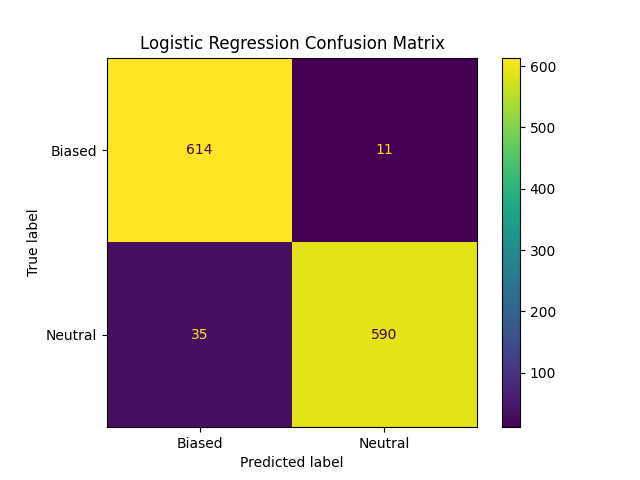</td>
    <td>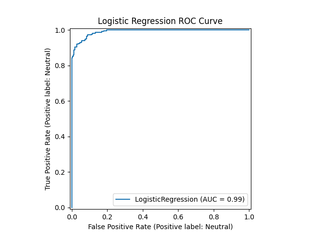</td>
    <td>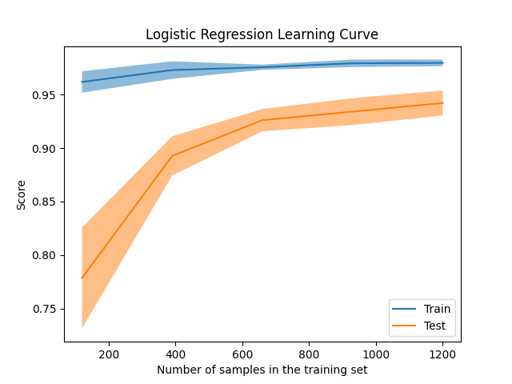</td>
  </tr>
  <tr>
    <td><b>Perceptron</b></td>
    <td>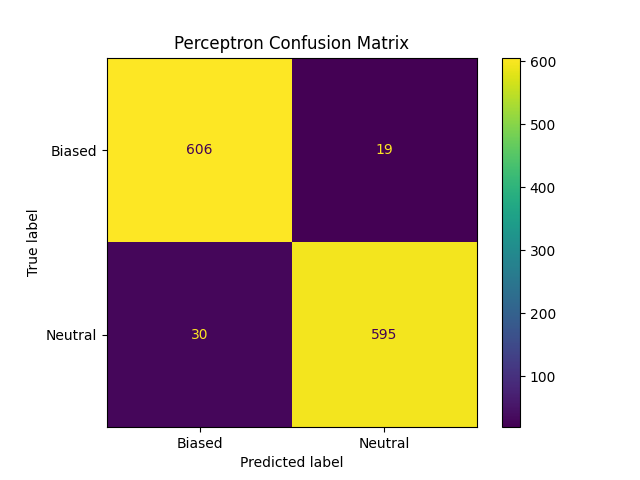</td>
    <td>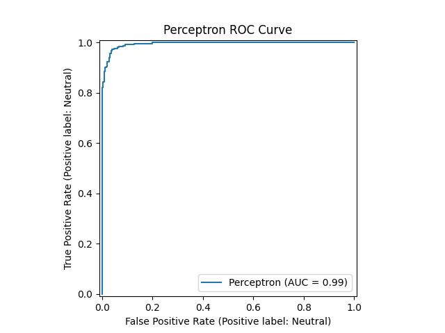</td>
    <td>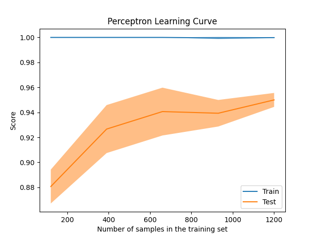</td>
  </tr>
  <tr>
    <td><b>Linear SVM</b></td>
    <td align="center">—</td>
    <td>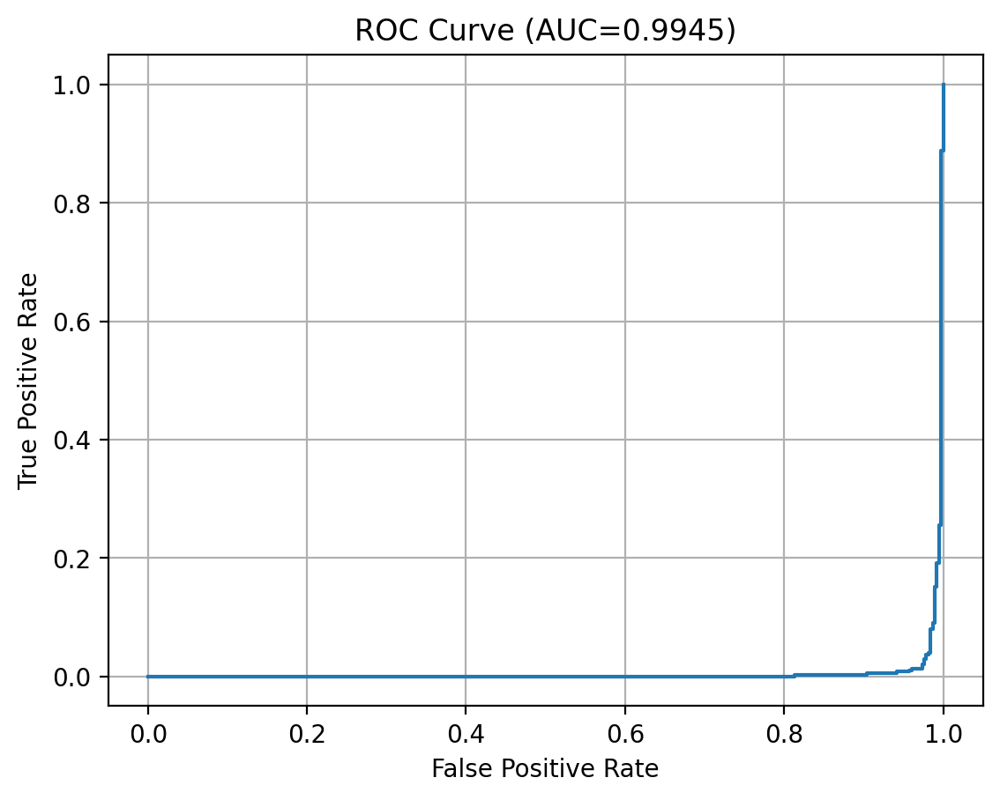</td>
    <td>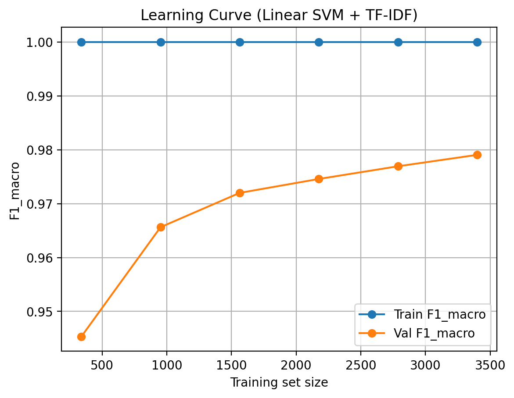</td>
  </tr>
  <tr>
    <td><b>1D CNN</b></td>
    <td>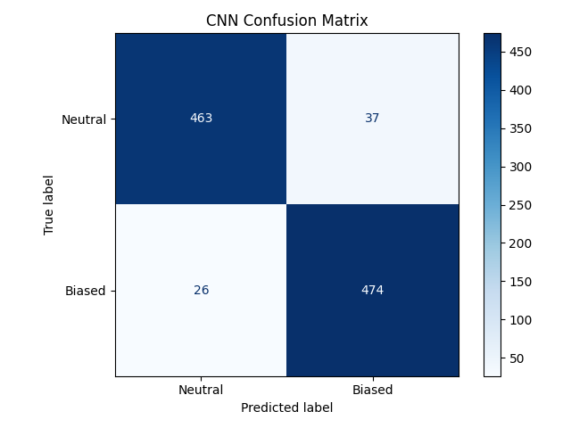</td>
    <td>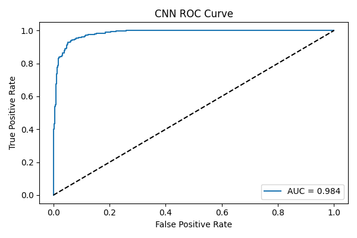</td>
    <td>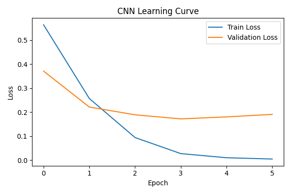</td>
  </tr>
</table>

## Tech Stack

| Area | Tools |
|---|---|
| Language | Python 3 |
| Data collection | `requests`, Guardian Content API |
| Data handling | `pandas`, `numpy` |
| NLP | `spaCy` (lemmatization), `NLTK` (stop words) |
| Classic ML | `scikit-learn` — `TfidfVectorizer`, `LogisticRegression`, `Perceptron`, `LinearSVC`, `GridSearchCV` |
| Deep learning | `TensorFlow` / `Keras` |
| Visualization | `matplotlib` |
| Experiments | Jupyter Notebook |

## Project Structure

```
.
├── data_loader.py            # Guardian API scraper → guardian_text.csv
├── data_prossing.py          # spaCy/NLTK preprocessing → guardian_palestine_preprocessed.csv
├── show_tfidf_matrix.py      # Inspect the TF-IDF matrix and top terms
├── LogisticRegression.py     # TF-IDF + Logistic Regression
├── Preceptron.py             # TF-IDF + Perceptron
├── linear_svm_model.py       # TF-IDF + Linear SVM with grid search
├── cnn_text_model.py         # 1D CNN (script version)
├── guardian_text.csv         # Main dataset (5,000 articles, ~42 MB)
├── Jupyter Notebooks/        # Notebook versions with saved outputs
├── Photos/                   # Confusion matrices, ROC and learning curves
├── requirements.txt
└── .env.example
```

## Data / Models

- **`guardian_text.csv` is included** (5,000 rows, columns `text, label`). It is the input for the three TF-IDF models, `show_tfidf_matrix.py` and the CNN notebook. To rebuild it from scratch, run `python data_loader.py` (see below).
- **No trained models are stored** — every script trains from scratch.
- **Two intermediate CSVs are not in the working tree**, but they are preserved in the git history (removed in commit `2f68e94`):
  - `guardian_israel_palestine_balanced_2000.csv` — an earlier 2,000-article dataset (`url, section, title, text, label`), the input of `data_prossing.py`
  - `guardian_palestine_preprocessed.csv` — the output of `data_prossing.py` (`processed_text, label`), the input of `cnn_text_model.py`

  Restore both with:

  ```bash
  git checkout 2f68e94^ -- guardian_israel_palestine_balanced_2000.csv guardian_palestine_preprocessed.csv
  ```

  You can also regenerate the preprocessed file from the restored 2,000-article CSV with `python data_prossing.py`. The current `data_loader.py` writes only `text, label`, so it cannot recreate the 2,000-article file (which also needs a `title` column).

> The CNN **notebook** (whose results are reported above) trains directly on `guardian_text.csv`; the standalone `cnn_text_model.py` script is the earlier version that trains on `guardian_palestine_preprocessed.csv`.

## How to Run

```bash
# 1. Clone and set up an environment
git clone https://github.com/SaadOsama10/news-bias-detection.git
cd news-bias-detection
python -m venv venv
source venv/bin/activate
pip install -r requirements.txt
python -m spacy download en_core_web_sm

# 2. (Optional) re-collect the dataset — uses the public "test" key unless you set your own
cp .env.example .env            # then put your key in .env
export $(grep -v '^#' .env | xargs)
python data_loader.py

# 3. Train and evaluate the TF-IDF models
python LogisticRegression.py
python Preceptron.py
python linear_svm_model.py
python show_tfidf_matrix.py

# 4. CNN — open the notebook (pip install notebook)…
jupyter notebook "Jupyter Notebooks/cnn_text_model.ipynb"
# …or run the script version after restoring its input (see Data / Models)
python cnn_text_model.py
```

`GUARDIAN_API_KEY` is optional: without it, `data_loader.py` falls back to the Guardian's public, rate-limited `test` key. Get a free key at <https://open-platform.theguardian.com/access/>.
